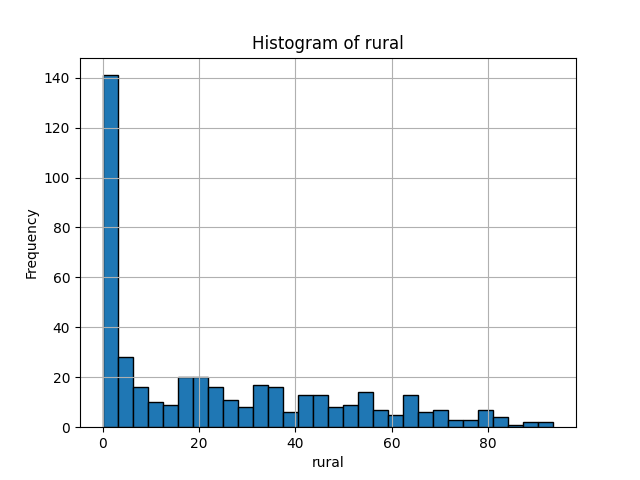

Describe:
|       |       cd |     pvi_22 |   urbanindex |    rural |   exurban |   suburban |    urban |
|:------|---------:|-----------:|-------------:|---------:|----------:|-----------:|---------:|
| count | 435      | 435        |    435       | 435      | 435       |  435       | 435      |
| mean  |  10.1379 |   0.679993 |     11.1913  |  24.2279 |  22.9927  |   27.8264  |  24.953  |
| std   |  10.596  |  31.9216   |      1.37872 |  25.0296 |  16.9409  |   21.4747  |  33.9672 |
| min   |   1      | -64.8256   |      8.14396 |   0      |   0       |    0       |   0      |
| 25%   |   3      | -26.0309   |     10.1197  |   0.4446 |   6.07752 |    9.13926 |   0      |
| 50%   |   6      |  -2.27852  |     11.1681  |  17.6087 |  23.5248  |   25.6766  |   3.7727 |
| 75%   |  13      |  25.692    |     12.2653  |  42.5949 |  34.4033  |   42.5043  |  44.3451 |
| max   |  52      |  77.4262   |     14.9034  |  93.5353 |  76.5436  |   83.9127  | 100      |

Describe:
|       |       cd |     pvi_22 |   urbanindex |    rural |   exurban |   suburban |    urban |
|:------|---------:|-----------:|-------------:|---------:|----------:|-----------:|---------:|
| count | 435      | 435        |    435       | 435      | 435       |  435       | 435      |
| mean  |  10.1379 |   0.679993 |     11.1913  |  24.2279 |  22.9927  |   27.8264  |  24.953  |
| std   |  10.596  |  31.9216   |      1.37872 |  25.0296 |  16.9409  |   21.4747  |  33.9672 |
| min   |   1      | -64.8256   |      8.14396 |   0      |   0       |    0       |   0      |
| 25%   |   3      | -26.0309   |     10.1197  |   0.4446 |   6.07752 |    9.13926 |   0      |
| 50%   |   6      |  -2.27852  |     11.1681  |  17.6087 |  23.5248  |   25.6766  |   3.7727 |
| 75%   |  13      |  25.692    |     12.2653  |  42.5949 |  34.4033  |   42.5043  |  44.3451 |
| max   |  52      |  77.4262   |     14.9034  |  93.5353 |  76.5436  |   83.9127  | 100      |

Describe:
|       |       cd |     pvi_22 |   urbanindex |    rural |   exurban |   suburban |    urban |
|:------|---------:|-----------:|-------------:|---------:|----------:|-----------:|---------:|
| count | 435      | 435        |    435       | 435      | 435       |  435       | 435      |
| mean  |  10.1379 |   0.679993 |     11.1913  |  24.2279 |  22.9927  |   27.8264  |  24.953  |
| std   |  10.596  |  31.9216   |      1.37872 |  25.0296 |  16.9409  |   21.4747  |  33.9672 |
| min   |   1      | -64.8256   |      8.14396 |   0      |   0       |    0       |   0      |
| 25%   |   3      | -26.0309   |     10.1197  |   0.4446 |   6.07752 |    9.13926 |   0      |
| 50%   |   6      |  -2.27852  |     11.1681  |  17.6087 |  23.5248  |   25.6766  |   3.7727 |
| 75%   |  13      |  25.692    |     12.2653  |  42.5949 |  34.4033  |   42.5043  |  44.3451 |
| max   |  52      |  77.4262   |     14.9034  |  93.5353 |  76.5436  |   83.9127  | 100      |

Describe:
|       |       cd |     pvi_22 |   urbanindex |    rural |   exurban |   suburban |    urban |
|:------|---------:|-----------:|-------------:|---------:|----------:|-----------:|---------:|
| count | 435      | 435        |    435       | 435      | 435       |  435       | 435      |
| mean  |  10.1379 |   0.679993 |     11.1913  |  24.2279 |  22.9927  |   27.8264  |  24.953  |
| std   |  10.596  |  31.9216   |      1.37872 |  25.0296 |  16.9409  |   21.4747  |  33.9672 |
| min   |   1      | -64.8256   |      8.14396 |   0      |   0       |    0       |   0      |
| 25%   |   3      | -26.0309   |     10.1197  |   0.4446 |   6.07752 |    9.13926 |   0      |
| 50%   |   6      |  -2.27852  |     11.1681  |  17.6087 |  23.5248  |   25.6766  |   3.7727 |
| 75%   |  13      |  25.692    |     12.2653  |  42.5949 |  34.4033  |   42.5043  |  44.3451 |
| max   |  52      |  77.4262   |     14.9034  |  93.5353 |  76.5436  |   83.9127  | 100      |

