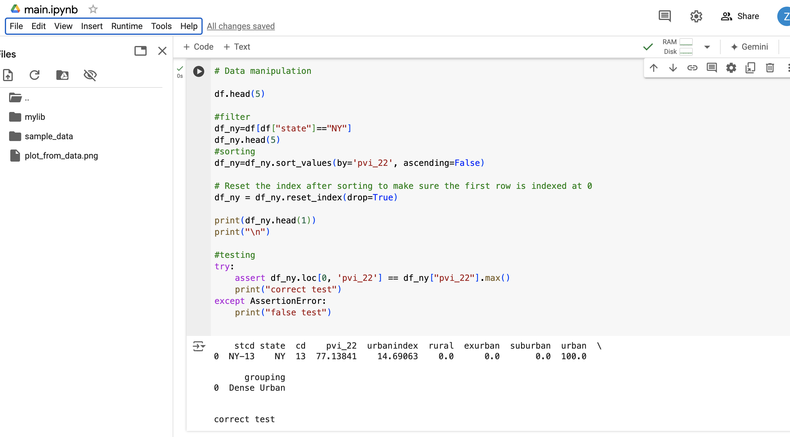

## Cloud-Hosted Notebook Data Manipulation

## Project Requirement

* <h/>Set up a cloud-hosted Jupyter Notebook (e.g., Google Colab)</h>
- Successfully setting up a cloud-hosted Jupyter Notebook at Google Colab.  

 
<h/> </h> 
* <h/> Perform data manipulation tasks on a sample dataset </h>  
    - 1. Filter Rows by State
    Here, we filter the dataset to include only rows where the state column has the value "NY" (New York). This creates a new DataFrame (df_ny) that contains only data specific to New York state. The head(5) function displays the first five rows of this filtered DataFrame for verification.
    - 2. Sort Data by a Specific Column
    After filtering, the data is sorted by the column pvi_22 in descending order. Sorting helps in identifying the rows with the highest pvi_22 values at the top of the DataFrame.
    - 3. Sort Data by a Specific Column
    After filtering, the data is sorted by the column pvi_22 in descending order. Sorting helps in identifying the rows with the highest pvi_22 values at the top of the DataFrame.
    - 4. Reset Index
    After sorting, we reset the index of df_ny. Resetting the index helps renumber the rows sequentially from 0, making the first row’s index 0. The parameter drop=True ensures that the old index is not added as a new column.
    - 5. Testing the Sorting
    Finally, an assertion is used to verify that the first row (index 0) has the maximum value in the pvi_22 column. This is a simple test to ensure that the data is sorted correctly, with the highest pvi_22 value at the top.

<h/> </h> 
 

## Project Report in Markdown  
[Link Text](DescribeStat.md)
## Project Report in Jupyter Notebook   
[Link Text](main.ipynb)

# Project Main Structure
This section explains the purpose of each file and directory in the project.
### **.devcontainer/**
Contains configuration files for setting up a development container environment, ensuring consistency in development setups.
### **.github/workflows/format.yml**
Defines a GitHub Actions workflow that automatically formats the codebase using tools like `black` or `prettier`.
### **.github/workflows/install.yml**
Specifies a GitHub Actions workflow that installs dependencies or sets up the project environment.
### **.github/workflows/lint.yml**
Configures a GitHub Actions workflow to run linting checks, ensuring the code follows the required style and quality standards.
### **.github/workflows/test.yml**
Sets up a GitHub Actions workflow to run tests, ensuring that the code passes all unit or integration tests.
### **mylib/lib.py**
Contains the core functionality or helper functions used across the project.
### **main.py**
The main entry point for the application, where the primary execution logic is implemented.
### **test_lib.py**
Holds unit tests for the functions or classes defined in `mylib/lib.py`, ensuring that they work as expected.
### **test_main.py**
Contains test cases for `main.py`, ensuring its logic and behavior are correct.
### **Makefile**
Defines automated commands for common tasks like building, testing, and cleaning the project.
### **requirements.txt**
Lists the Python dependencies required for the project to run, making it easy to install them with `pip`.
### **repeat.sh**
be used to automate repetitive tasks or to rerun certain operations continuously

## Template for Python projects with RUFF linter

* `Makefile`

* `Pytest`

* `pandas`

* `Ruff`:  

Run `make lint` which runs `ruff check`. 

* `Dockerfile`

* `GitHub copilot`

* `jupyter` and `ipython` 

* A base set of libraries for devops and web

* `githubactions`

